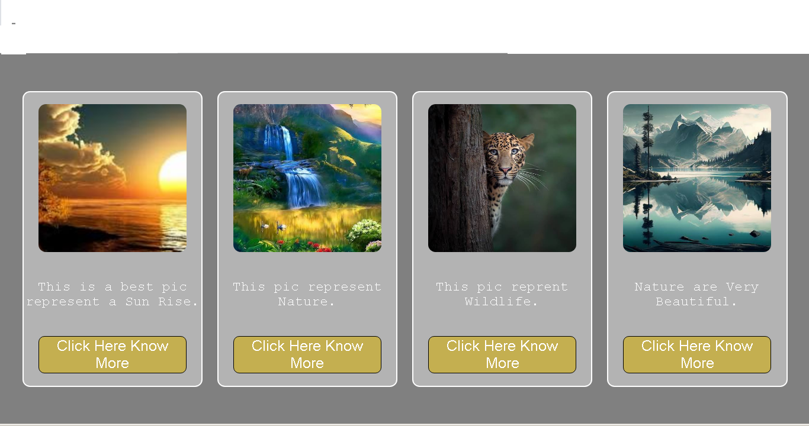

# Wildlife Reading Card

A simple wildlife-themed card layout built using HTML and CSS Flexbox.

## Features

- Responsive card layout
- Flexbox for alignment
- Image hover zoom effect
- Modern card design
- Styled buttons
- Rounded corners

## Technologies Used

- HTML5
- CSS3
- Flexbox

## Project Screenshot

## Author

Ankit Paswan